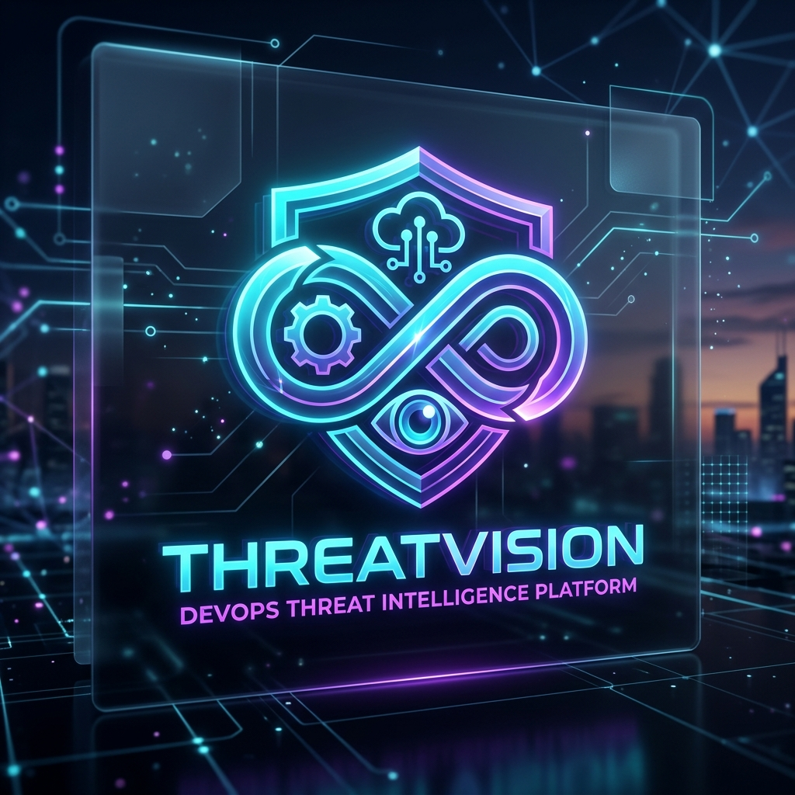
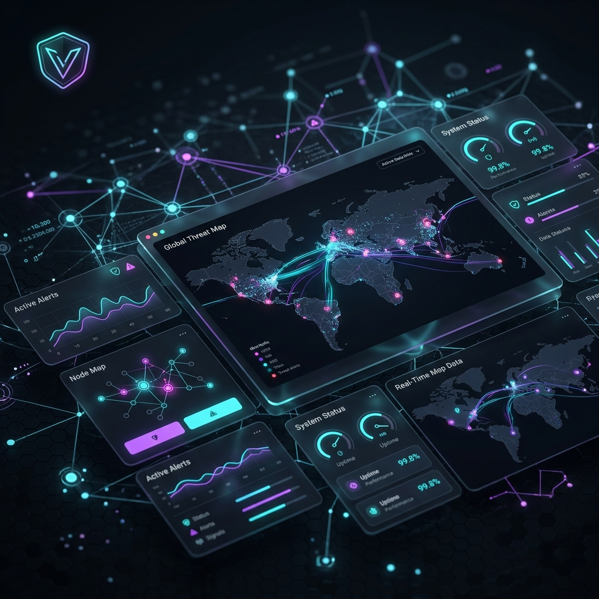
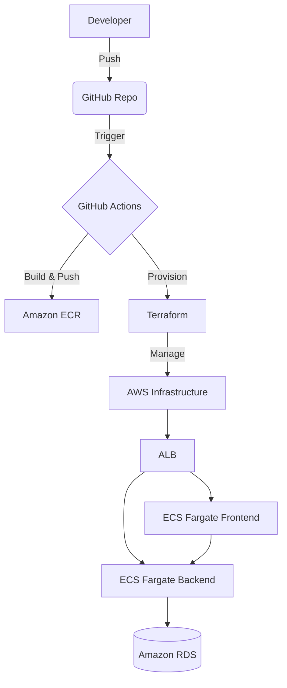
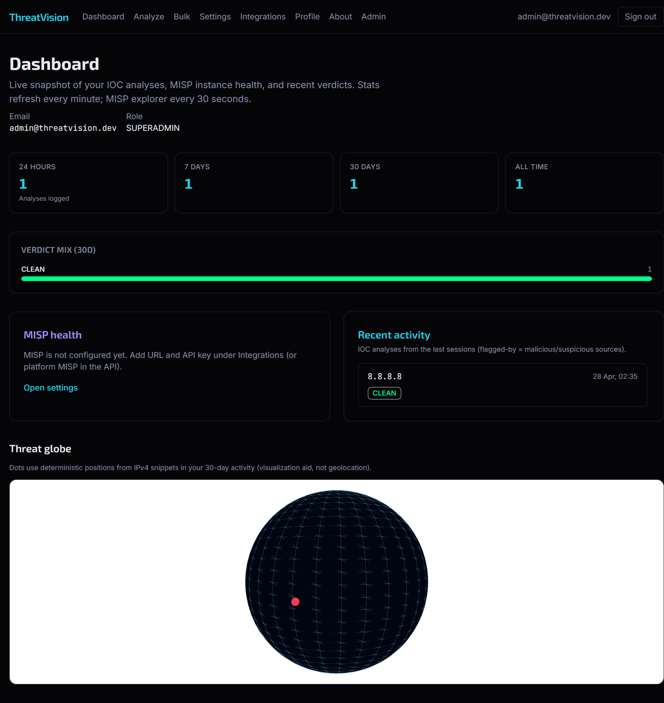
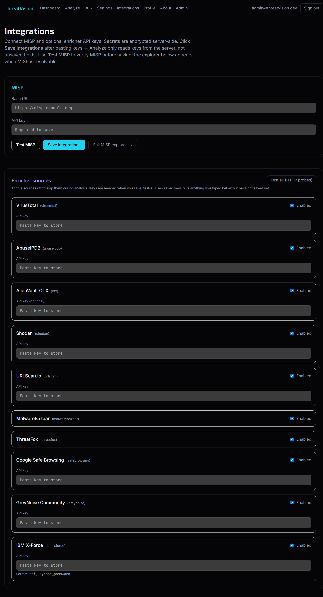
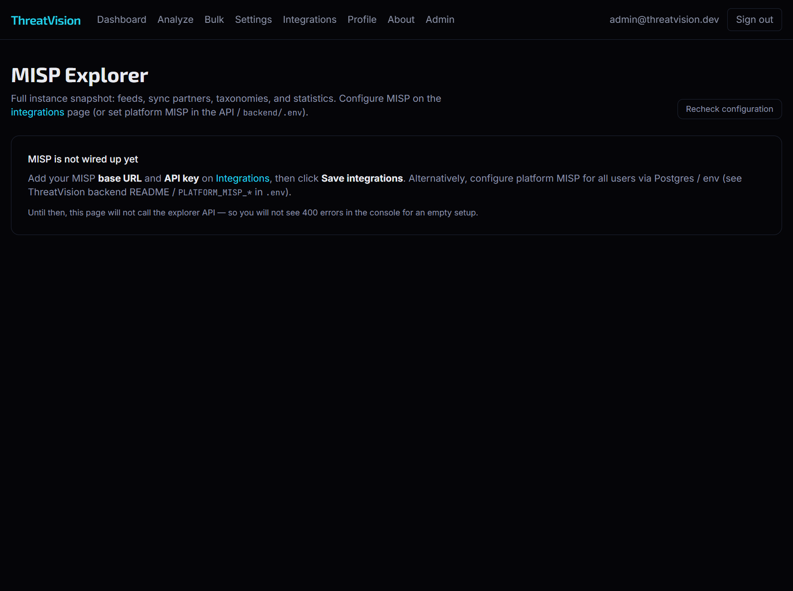

# 🛡️ ThreatVision: The Ultimate Threat Intelligence Platform

<p align="center">
  
</p>



<div align="center">

[](https://www.terraform.io/)
[](https://aws.amazon.com/)
[](https://aws.amazon.com/ecs/)
[](https://github.com/features/actions)

**Transforming raw threat data into actionable intelligence with a production-grade DevOps pipeline.**

[Explore the App](http://threatvision-alb-2018723688.ap-south-1.elb.amazonaws.com) • [Report Bug](https://github.com/saichandram-sadhu/threatvision/issues) • [Request Feature](https://github.com/saichandram-sadhu/threatvision/issues)

</div>

---

## 📽️ Project Vision

**ThreatVision** is a statement in modern security operations. It bridges the gap between complex MISP data and human-readable insights. This project showcases a full-scale DevOps migration from a local "it works on my machine" state to a globally accessible, resilient AWS infrastructure.

---

## 🏗️ DevOps Architecture

Our architecture follows the **Well-Architected Framework** principles, ensuring high availability, security, and automated recovery.



### The CI/CD Blueprint
1.  **Code (GitHub)**: Semantic versioning and trunk-based development.
2.  **Build (Docker)**: Multi-stage builds for minimal image size.
3.  **Registry (ECR)**: Private, encrypted container image storage.
4.  **Provisioning (Terraform)**: Declarative infrastructure management.
5.  **Compute (ECS Fargate)**: Serverless container execution—no EC2 to manage!
6.  **Database (RDS)**: Multi-AZ PostgreSQL for data integrity.

---

## 🌩️ Deployment Journey & Challenges

The path to production was paved with technical challenges that we conquered through systematic debugging and automation.

### 🔴 The 503 Backend Mystery (Fixed)
*   **Problem**: Backend services kept restarting (0/1 tasks) due to failing health checks.
*   **Solution**: Improved the database pool warmup logic and adjusted the ALB `health_check_grace_period` in Terraform.

### 🔴 Proxy 401: The JWT Wall (Fixed)
*   **Problem**: NextAuth sessions weren't propagating through the ALB network layers.
*   **Solution**: Refactored the frontend proxy to use `getToken` for reliable session forwarding.

### 🔴 MISP 405: The Missing Link (Fixed)
*   **Problem**: MISP Explorer endpoints returned `Method Not Allowed`.
*   **Solution**: Implemented missing `GET` handlers in the FastAPI backend to support frontend synchronization.

---

## 📊 Live Platform Preview

<div align="center">

### 🚀 Performance Dashboard

*Real-time visibility into IOC analyses and system health.*

### 🔌 Integrations & Config

*Seamlessly connect MISP, OpenCTI, and custom threat sources.*

### 🔍 MISP Explorer

*Interactive exploration of threat intelligence events.*

</div>

---

## ⌨️ Command Center

### 🚀 Terraform Management
```bash
# Initialize the cloud foundation
terraform init

# Plan the infrastructure changes
terraform plan -out=tfplan

# Apply with confidence
terraform apply "tfplan"
```

### 🐳 Container Ops
```bash
# Build the production image
docker build -t threatvision-backend ./backend

# Ship it to ECR
aws ecr get-login-password --region ap-south-1 | docker login ...
docker push <aws_id>.dkr.ecr.ap-south-1.amazonaws.com/threatvision-backend:latest
```

---

## 🛡️ Security Hardening
- **IAM Least Privilege**: Fine-grained roles for ECS tasks.
- **VPC Isolation**: RDS and Backend in private subnets.
- **ALB Encryption**: Managed traffic routing with path-based rules.

---

<div align="center">

**Built for Security Engineers. Engineered for DevSecOps.**

[Back to top ↑](#-threatvision-the-ultimate-threat-intelligence-platform)

</div>
